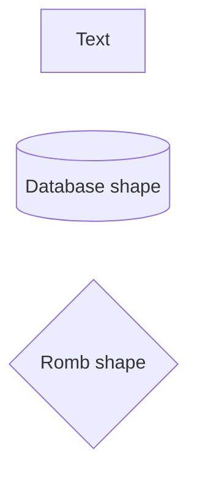
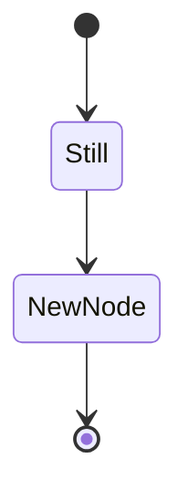

```mermaid
graph  LR;
Text
id1(Some Cool text here)
id1[(Database shape)]
id2{Romb shape}
```

```mermaid
stateDiagram
[*] --> Still
Still --> NewNode
NewNode --> [*]
```

```mermaid
pie
title How many pets
"Dogs" : 1
"Cats" : 5
"Parrots" : 2
"Rats" 
```

